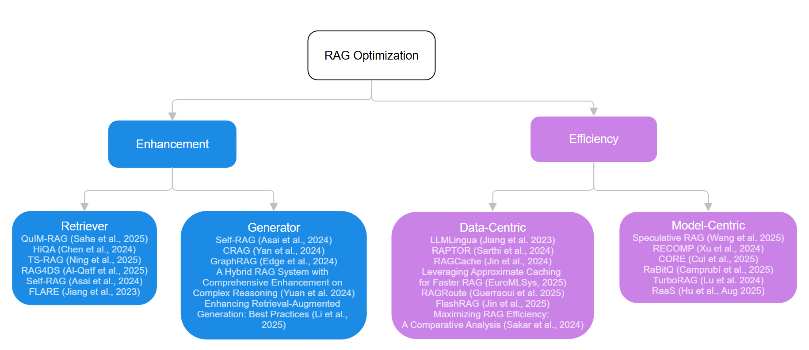

# Awesome-CSCE670-Survey-OptimizationRAG

## A Survey on Enhancement and Efficiency in Retrieval-Augmented Generation

[](project-report.pdf)
[](https://opensource.org/licenses/MIT)

**Authors:** Guiyan He, Yi-Hsin Chiang, Xiaochuan (Sean) Ge  
**Institution:** Texas A&M University

---

## 📋 Overview

This survey systematically examines recent advances in **Retrieval-Augmented Generation (RAG)** optimization through two primary dimensions:

- **Enhancement**: Improving quality and robustness through retriever and generator optimization
- **Efficiency**: Reducing computational costs through data-centric and model-centric approaches

We provide detailed analysis of representative methods with practical insights for both researchers exploring open problems and engineers implementing production systems.


*Overview of Enhancement and Efficiency Methods in RAG*

---

## 🎯 Key Contributions

1. **Optimization-Focused Analysis**: Emphasis on concrete optimization techniques rather than broad architectural overviews
2. **Goal-Oriented Organization**: Content organized by optimization objective (enhancement vs. efficiency) to make trade-offs explicit
3. **Practical Implementation Guidance**: Detailed case studies explaining what methods do, how they work, and when to apply them
4. **Gap Identification**: Addresses the need for actionable guidance missing in existing broad surveys

---

## 📊 Survey Structure

### Enhancement Methods

#### Retriever Optimization

- **Query Understanding and Reformulation**
  - Multi-Query Intent Modeling (QuIM-RAG)
  - Hierarchical Query Processing (HiQA)
- **Time-Aware and Domain-Adaptive Retrieval**
  - Temporal Sensitivity Modeling (TS-RAG)
  - Domain-Specific Adaptation (RAG4DS)
- **Introspective and Dynamic Retrieval**
  - Self-Reflective Retrieval (Self-RAG)
  - Confidence-Based Active Retrieval (FLARE)

#### Generator Optimization

- **Introspective Generation and Self-Correction**
  - Dual-Mode Reflection (Self-RAG)
- **Corrective Mechanisms and Fallback Strategies**
  - Multi-Source Corrective Retrieval (CRAG)
  - Best Practices Integration
- **Structured Reasoning and Graph-Based Synthesis**
  - Knowledge Graph-Based Reasoning (GraphRAG)
  - Hybrid Reasoning Enhancement
- **Retrieval-Augmented Fine-Tuning**
  - Open-Book Training Paradigm (RAFT)

### Efficiency Methods

#### Data-Centric Optimizations

- **Prompt Compression and Context Filtering**
  - Information-Theoretic Pruning (LongLLMLingua)
  - Generative Context Synthesis (SCOPE)
  - Attention-Guided Pruning (AttentionRAG)
- **Knowledge State Management and KV Caching**
  - Prefix Caching Structures (RAGCache)
  - Non-Prefix State Fusion (CacheBlend)
  - Offline-Online Hybrid (TurboRAG)
  - Reranker Optimization (HyperRAG)
- **Efficient Indexing and Knowledge Representation**
  - Hardware-Aware Partitioning (VectorLiteRAG)
  - Structured Hypergraphs (HyperGraphRAG)

#### Model-Centric Optimizations

- **Speculative and Parallel Decoding**
  - Specialist Drafting (Speculative RAG)
  - Retrieval-Based Drafting (REST)
  - Long-Context Transfer (RAPID)
- **Architecture and Attention Optimization**
  - Linearizing Attention (Block-Attention)
- **Adaptive and Dynamic Execution**
  - Complexity-Aware Routing (Adaptive-RAG)
  - Agentic Feedback (FAIR-RAG)
- **System-Algorithm Co-Design**
  - Pipeline Parallelism (PipeRAG)
  - Joint Scheduling (METIS)

---

## 🔬 Evaluated Methods

### Enhancement Methods

| Method | Type | Key Innovation | Performance Gain |
|--------|------|----------------|------------------|
| **Self-RAG** | Introspective | Reflection tokens for retrieval/generation critique | 5-10% accuracy improvement, 12-18% hallucination reduction |
| **CRAG** | Corrective | Multi-source fallback with web search | 10-15% improvement on time-sensitive queries |
| **GraphRAG** | Structured | Entity-relationship graphs with community detection | 100-130% better on global queries |
| **RAFT** | Fine-tuning | Open-book training with distractor documents | 7-35% accuracy gains across benchmarks |
| **FLARE** | Dynamic | Confidence-based retrieval triggering | Higher factual accuracy on long-form generation |
| **QuIM-RAG** | Query Processing | Multi-intent decomposition | 15-20% improvement on multi-faceted questions |

### Efficiency Methods

| Method | Type | Key Innovation | Speedup/Compression |
|--------|------|----------------|---------------------|
| **LongLLMLingua** | Compression | Information-theoretic pruning | Up to 20x compression |
| **RAGCache** | Caching | Knowledge Tree with prefix-aware policy | 4x TTFT reduction |
| **TurboRAG** | Caching | Offline corpus encoding with KV fusion | Up to 9.4x TTFT reduction |
| **Speculative RAG** | Decoding | Specialist drafter with parallel verification | 50%+ latency reduction, 12.97% accuracy gain |
| **CacheBlend** | Caching | Selective recomputation for non-prefix chunks | 2.8-5x throughput improvement |
| **AttentionRAG** | Compression | Attention-guided token pruning | 6.3x compression, 10% accuracy gain |
| **PipeRAG** | Parallelism | Overlapped retrieval and generation | 2.6x speedup |
| **METIS** | Scheduling | Joint query scheduling and RAG configuration | 1.64-2.54x latency reduction |

---

## 📚 Datasets & Benchmarks

### Common RAG Evaluation Datasets

- **Natural Questions**: Open-domain QA from Google search queries
- **TriviaQA**: Trivia questions requiring factual knowledge
- **HotpotQA**: Multi-hop reasoning tasks
- **PubMedQA**: Biomedical question answering
- **WebGPT**: Web-based QA with citations

### Evaluation Metrics

- **Accuracy**: Exact Match (EM), F1 Score, BLEU, ROUGE
- **Quality**: Factual correctness, relevance, coherence
- **Efficiency**: Latency, throughput, TTFT, memory usage
- **Attribution**: Citation accuracy and groundedness

---

## 🎓 Target Audience

### For Researchers

- Open problems and emerging directions
- Need for standardized efficiency benchmarks
- Methods for handling contradictory information
- Optimal model size combinations in compound architectures

### For Engineers

- Concrete guidance on technique selection
- Implementation trade-offs and performance characteristics
- Production deployment considerations
- Real-world optimization strategies

---

## 🔮 Future Directions

1. **Standardized Benchmarks**: Joint evaluation of accuracy and efficiency trade-offs
2. **Technique Composition**: Exploring optimal combinations of multiple optimization methods
3. **Multimodal Extension**: Adapting approaches to multimodal and multilingual RAG systems
4. **Agentic Evolution**: Continued shift toward self-correcting, introspective architectures
5. **System-Level Co-Design**: Deeper integration of retrieval, generation, and serving infrastructure

---

## 📖 Citation

If you find this survey useful for your research, please cite:

```bibtex
@article{he2025rag-survey,
  title={A Survey on Enhancement and Efficiency in Retrieval-Augmented Generation},
  author={He, Guiyan and Chiang, Yi-Hsin and Ge, Xiaochuan},
  institution={Texas A\&M University},
  year={2025}
}
```
